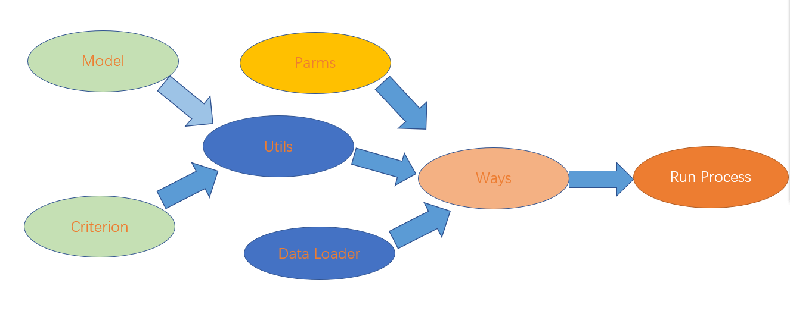

[TOC]


# Experiment Two


## 

## 一：Little_exercise:

```python
import torch

'''实现softmax函数'''
def softmax(x):
    e_x = torch.exp(x - torch.max(x))
    return e_x / e_x.sum(dim=1, keepdim=True)


'''实现sigmoid函数'''
def sigmoid(x):
    return 1 / (1 + torch.exp(-x))


'''实现softmax交叉熵损失函数'''
def cross_softmax(y_true,y_pred):
    y_pred = torch.softmax(y_pred, dim=1)
    # 对预测的概率进行稳定的log运算
    log_y_pred = torch.log(y_pred + 1e-7)
    # 创建一个one-hot矩阵
    one_hot = torch.zeros_like(y_pred)
    one_hot.scatter_(1, y_true.long(), 1)
    # 与one-hot标签相乘，然后取负数，然后求和。最后求平均值
    loss = - torch.mean(log_y_pred * one_hot)

    return loss


'''实现sigmoid交叉熵损失函数'''
def cross_sigmoid(y_true,y_pred):
    y_pred_sig = sigmoid(y_pred)
    loss = -y_true * torch.log(y_pred_sig) - (1 - y_true) * torch.log(1 - y_pred_sig)
    return torch.mean(loss)
```

## 二：Mnist:

```python
from torchvision import datasets, transforms
import torch
import torch.nn as nn
from torch import optim
import os


os.environ['KMP_DUPLICATE_LIB_OK'] = 'True'

# Checking if GPU is available
device = torch.device("cuda" if torch.cuda.is_available() else "cpu")

class DataLoader:

    def load_mnist(self, batch_size=64):

        transform = transforms.Compose([
            transforms.ToTensor(),
            transforms.Normalize((0.3,), (0.3,)),
            transforms.Lambda(lambda x: torch.cat((x.view(-1), torch.ones(1, device=x.device))))
        ])
        trainset = datasets.MNIST('mnist_train', train=True, download=True, transform=transform)
        testset = datasets.MNIST('mnist_test', train=False, download=True, transform=transform)
        trainloader = torch.utils.data.DataLoader(trainset, batch_size=batch_size, shuffle=True)
        testloader = torch.utils.data.DataLoader(testset, batch_size=batch_size, shuffle=True)

        return trainloader, testloader


class Model(nn.Module):
    def __init__(self, ndim, class_num=10):
        super(Model, self).__init__()
        self.w1 = nn.Parameter(torch.rand(ndim, 785).to(device) * 0.2 - 0.1)
        self.w2 = nn.Parameter(torch.rand(785, class_num).to(device) * 0.2 - 0.1)
        # self.l1=nn.Linear(ndim,785)
        # self.f=nn.Sigmoid()
        # self.l2=nn.Linear(785,10)
    def forward(self, x):

        self.A=torch.sigmoid(x@self.w1)
        return self.A@self.w2
        # self.A = self.l1(x)
        # self.B = self.f(self.A)
        # return self.l2(self.B)


class Params:
    def __init__(self, lamuda=0.01, batch_size=64, class_num=10,feature_num=785,epoch=20):
        self.lamuda = lamuda
        self.batch_size = batch_size
        self.class_num = class_num
        self.feature_num=feature_num
        self.epoch=epoch


class Criterion:
    def cross_entropy_loss(self, y_true, y_pred):
        y_pred = torch.softmax(y_pred, dim=1)
        log_y_pred = torch.log(y_pred + 1e-7)
        one_hot = torch.zeros_like(y_pred)
        one_hot.scatter_(1, y_true.long().unsqueeze(1), 1)
        loss = - torch.mean(log_y_pred * one_hot)

        return loss


class Utils:
    def __init__(self, params):

        self.params = params
        self.trainloader, self.testloader = DataLoader().load_mnist(self.params.batch_size)
        self.model = Model(ndim=self.params.feature_num, class_num=self.params.class_num).to(device)
        self.optimizer = optim.Adam(self.model.parameters(), lr=0.01)


    def train_one_step(self, xs, ys):
        xs, ys = xs.to(device), ys.to(device)
        self.optimizer.zero_grad()
        y_preds = self.model(xs)
        loss = Criterion().cross_entropy_loss(ys, y_preds)
        loss.backward()
        self.optimizer.step()
        return loss

    def predict(self, xs):
        xs = xs.to(device)
        with torch.no_grad():
            y_preds = self.model(xs)
        return y_preds

    def evaluate(self, ys, ys_pred):
        ys, ys_pred = ys.to(device), ys_pred.to(device)
        ys_pred = torch.argmax(ys_pred, dim=1)
        diff_count = (len(ys) - torch.sum(torch.logical_not(torch.eq(ys, ys_pred)))).float()
        return diff_count / len(ys)


class Ways(Utils):
    def __init__(self, params):

        super(Ways, self).__init__(params)


    def Softmax(self):

        for epoch in range(self.params.epoch):
            for x, y in self.trainloader:
                x, y = x.to(device), y.to(device)
                loss = self.train_one_step(x,y)
            if epoch%1==0:
                print(f'loss at epoch {epoch} is {loss.item():.4f}')

        train_accuracy = self.evaluate_batch(self.trainloader)
        test_accuracy = self.evaluate_batch(self.testloader)
        print(f'Softmax->Training set: precision= {train_accuracy}')
        print(f'Softmax->Test set: precision={test_accuracy}')

    def evaluate_batch(self, dataloader):
        total_accuracy = 0
        total_count = 0
        for x, y in dataloader:
            x, y = x.to(device), y.to(device)
            y_pred = self.predict(x)
            total_accuracy += self.evaluate(y, y_pred).item() * len(y)
            total_count += len(y)
        return total_accuracy / total_count

class RunProcess:
    def __init__(self, params):

        self.comp = Ways(params)

    def run(self):
        self.comp.Softmax()

if __name__ == '__main__':

    params = Params(lamuda=0.01,batch_size=2048,feature_num=785,class_num=10,epoch=20)
    process = RunProcess(params)
    process.run()
    # out
    # Softmax->Training set: precision= 0.9985333333333334
    # Softmax->Test set: precision=0.9754000044822693
```

## 三：分析与总结:

### 1>分析：

#### 代码结构：



#### 模块说明：


#### 实验结果：


​	天行大道，地和九坤。经过我不限的努力，得到这个精度也是理所应当的结果。但是这个代码很魔幻啊，它在晚上训练的时候效果会这么好，但是下午训练，效果就不咋地了。可能和随机数有关。当然这里最关键的是，在两个线性层之间，加了一个sigmoid函数，不过如果加softmax函数的话，结果只有95发左右。

### 2>总结：


​         这次实验相比较于上一次少了一些，但是我是一个追求完美的男人，我总是再追求写一份超级完美的代码，但是无论我怎么努力，回过头来看代码都会有问题。这次也是一样的，我刚开始再model里面放置了两层的nn.liner（）层，我发现效果还可以，能达到80发左右，但是，我看网上一些其他人的都有95发，96发，我就觉得我的代码是不是哪里有问题啊。然后就一直修改，当然为了展示我的学识，我故意不用torch库里面的liner，自己实现一个。这一换不要紧啊，换了之后直接猴子他妈，狒狒了。这效果剩下了只有60发左右，四舍五入，约等于没有效果嘛。于是啊，一直再想哪里出现了问题，后来经过我不断的调试发现，我需要在交叉熵损失函数那里加一个极小值，损失就不会爆炸了，但是效果依然不是很好。最后呢，偶尔看见其他人写的函数，我终于明白了，两层线性层之间要加一个softmax，或者sigmoid函数，那效果嘎嘎好。直接飙升到98发。这也很容易理解，要是不加这个非线性，两成不就退化成了一层嘛。

​		总得来说，虽然这次实验遇到了一些麻烦，但是相比较于上次实验来说，还是好多了，以为需要做的东西比较少嘛。哈哈哈，还有就是，我把所有的方法都写在了类里面，这样下次写的时候应该就可以方便一点了。但是，我不但不说的是，这个代码真的复制到word后很难看，我怎么调都调不好看，可能因为我就不知道什么是好看，哎，风萧萧兮易水寒。


